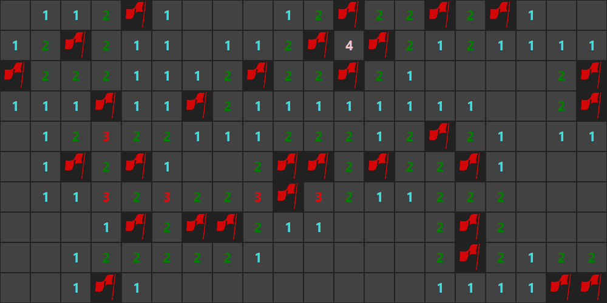

# Minesweeper 

> A customizable minesweeper implementation using JavaFX.

[](https://opensource.org/licenses/MIT)
[](https://travis-ci.com/DerYeger/minesweeper)
[](https://codecov.io/gh/DerYeger/minesweeper)
[](https://jitpack.io/#DerYeger/minesweeper)

Minesweeper provides an implementation of the classic game with customizable graphics and game settings.



## Gradle

In your build.gradle add
```
allprojects {
    repositories {
        ...
        maven { url 'https://jitpack.io' }
    }
}
```
and
```
dependencies {
    ...
    implementation 'com.github.deryeger:minesweeper:0.3'
}
```

## Usage

With the builder you can quickly create Minesweeper configurations, which in return provide game instances in form of Node objects.
```
Minesweeper minesweeper = Minesweeper
                .builder()
                .width(20)
                .height(10)
                .bombCount(40)
                .cellSize(30)
                .onGameWon(() -> someMethod())
                .onGameLost(() -> someOtherMethod())
                .build();

Node view = minesweeper.instance();
```

## Release History

- 0.3
    - Added style classes to numbers
    - Added flag and mine icons
- 0.2
    - Removed unnecessary getter and setter methods
    - Removed example
    - Improved code quality
- 0.1
    - WIP Alpha Release

## Licenses

- Flying flag icon by [Lorc](http://lorcblog.blogspot.com/) under [CC BY 3.0](https://creativecommons.org/licenses/by/3.0/)
- Unlit bomb icon by [Lorc](http://lorcblog.blogspot.com/) under [CC BY 3.0](https://creativecommons.org/licenses/by/3.0/)